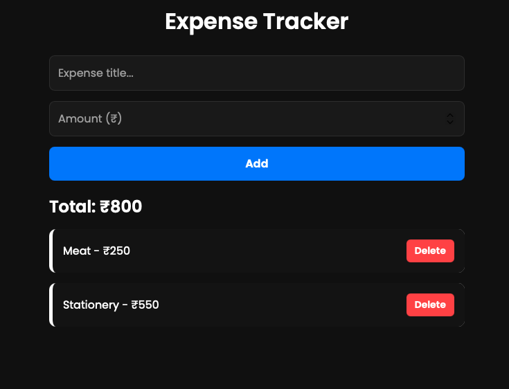

# 💰 Expense Tracker | Day 5

---

A modern Expense Tracker app built using **HTML, CSS, and JavaScript** with full localStorage support.

---

## 🚀 Features
• Add expenses  
• Delete expenses  
• Total auto-calculation  
• Saves data using localStorage  
• Clean neon blue UI  
• Responsive design  

---

## 🛠 Tech Stack
HTML, CSS, JavaScript

---

## 📸 Screenshots


## 📁 Folder Structure
```

│── index.html  
│── style.css  
│── script.js  

```
---

### 🔥 15 Frontend Projects in 15 Days

Follow along as I learn and build daily.

---

## 📬 Contact

**Tushar**  
📧 Email: gaudaratushar@gmail.com  
🔗 LinkedIn: www.linkedin.com/in/tushargaudara
🔗 GitHub: https://github.com/tushargaudara

---

## ⭐ Show Your Support

If you like this project, **give it a star ⭐ on GitHub!**  
Your support motivates me to build more projects 🙌